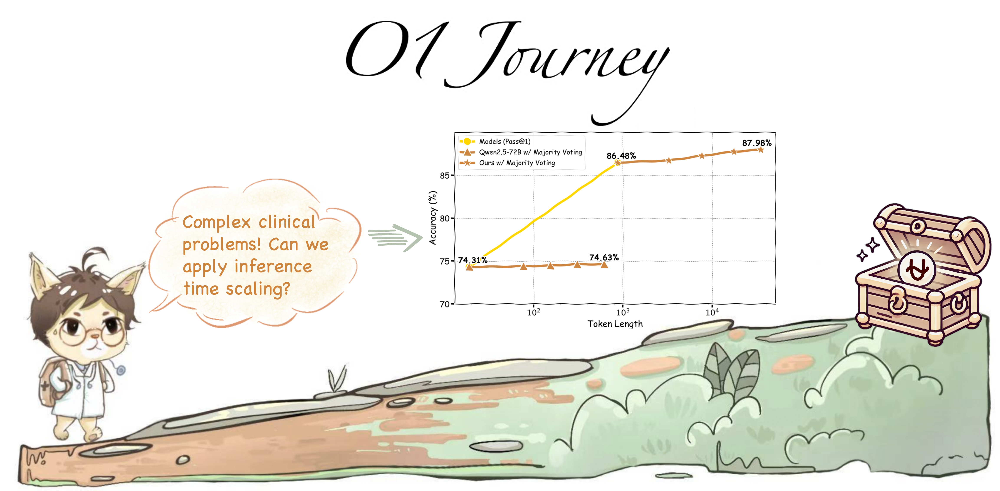

# Journey of Ophiuchus


## About the Project





[Zhongzhen Huang](https://scholar.google.com/citations?user=LrZdFHgAAAAJ), [Kui Xue](https://scholar.google.com.hk/citations?user=js7lIpMAAAAJ), [Shengyi Hua](https://github.com/hsymm), [Zhen Huang](https://huangzhen02.github.io), [Haoyang Zou](https://scholar.google.com/citations?user=btPmUcoAAAAJ&hl=en), [Pengfei Liu](https://plms.ai/), [Xiaofan Zhang](https://scholar.google.com/citations?user=30e95fEAAAAJ)


## 🎉 News
- **\[2025/01\]** 🚨 We have officially released [**our technical report**]() and the training dataset on 🤗 [Hugging Face](https://huggingface.co/datasets/SPIRAL-MED/o1-journey-Ophiuchus).


## Progress

###[**Report (Part1)**]() | [**Citation**](#citation)


This paper investigates the application of inference time scaling in the medical domain, focusing on complex reasoning, spanning tasks from diagnostic decision-making to treatment planning. 

Key findings include:

- Long thought processes require sufficient domain knowledge and instruction-following ability to function effectively during testing.
- Majority voting offers a simple method for augmenting inference time computation, though its efficacy is limited.
- Harder tasks necessitate longer reasoning processes, supporting the idea that task complexity drives the need for more extensive thought chains.
- The multiple-choice options can be removed to encourage the generation of free-form responses, enabling an exploration of the potential of medical journey learning. The model's reasonable responses underscore the promising capability of inference time scaling and journey learning in advancing LLM performance in real-world clinical reasoning tasks.


## Contact Us

If you are interested in our project and would like to join us, feel free to send an email to [xiaofan.zhang@sjtu.edu.cn](mailto:xiaofan.zhang@sjtu.edu.cn).

## Citation

```

```
